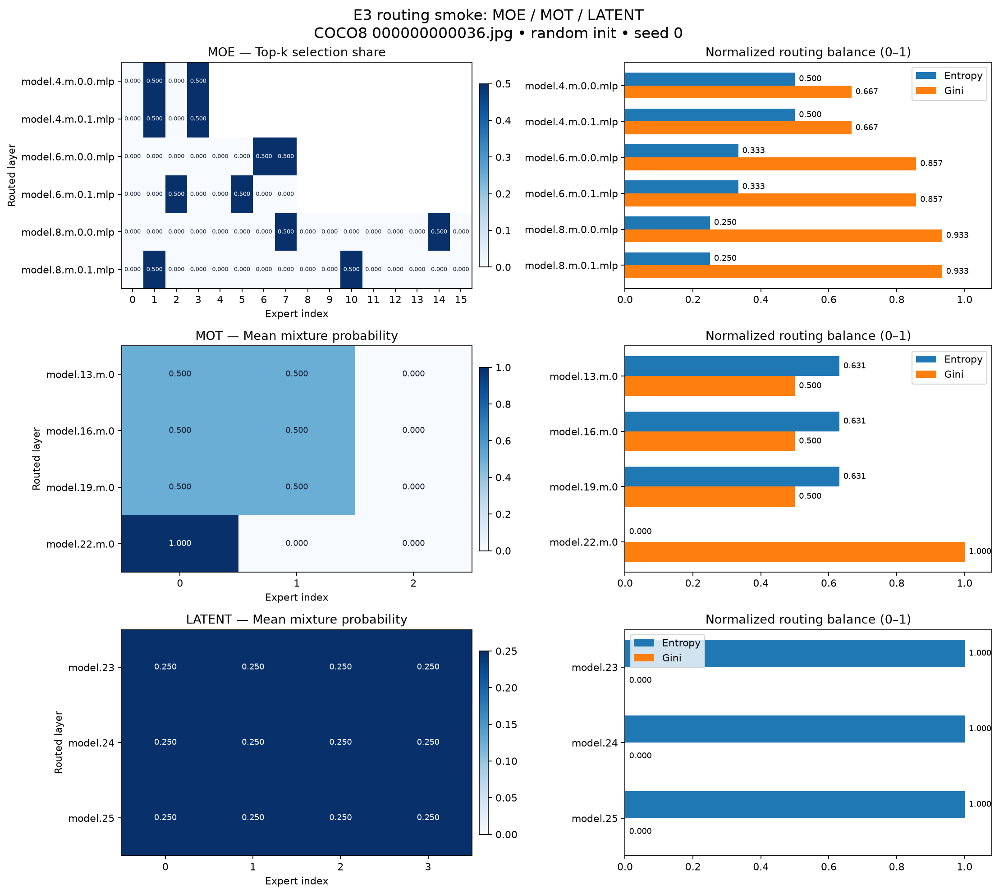

# E3 路由透视镜：可复现 smoke
Owner：@XavierYChen。腾讯基线：`246e79cfe418cfd90f4738bace56b02245dc38f8`。
本目录、`scripts/e3_routing_smoke.py` 和 `tests/test_e3_routing_smoke.py` 为项目新增；腾讯原文件不改。

## 当前完成到哪里
本工具提供 COCO8 单图、MoE/MoT/Latent 三类的结构化记录、静态图、输出一致性检查和推理采集 on/off 数字。
这是准入 smoke 与 P0 原型，不能把 PASS 当作 P1 训练减速 <10% 或 P2 完成。
正式任务书的准入条目并未限定只测 MoT。别人采用单族是执行选择，三族图不必与别人相同。

## 最新实测图



分族高清图：[MoE](results/verified-cpu-v5-annotated-20260906/moe_expert_usage.png) ·
[MoT](results/verified-cpu-v5-annotated-20260906/mot_expert_usage.png) ·
[Latent](results/verified-cpu-v5-annotated-20260906/latent_expert_usage.png)

图中 `0.000` 是本次记录经三位小数显示后的数值；完整精度保留在 JSON/JSONL。
颜色范围按每个族实际范围设置，比较颜色深浅时只应在同一个面板及其色条内进行。

## 你这台电脑怎么跑
打开 **Anaconda Prompt**，复制以下命令（每行执行一次）：

```bat
cd /d D:\AI\YOLO-Master
set "E3_PYTHON=D:\AI\envs\yolo_master\python.exe"
reports\e3_routing_smoke\run_smoke.cmd
```

默认 CPU、320、seed=0、3 次预热和 20 对交替测量。本机调试时出现过 CUDA 分配失败及 Windows 分页文件不足，因此 CPU 是当前默认值。
每次自动创建新的 `reports/e3_routing_smoke/results/run-时间/`，终端最后打印实际路径。仓库中已提交的最新版完整证据是 `results/verified-cpu-v5-annotated-20260906/`，其中四张 PNG 都带三位小数标注。
不要再拿旧 `results/summary.json` 判断本次结果。

只测 MoT（便于理解单族结果）：

```bat
reports\e3_routing_smoke\run_smoke.cmd --families mot
```

可选 GPU 测试（失败会保留日志，不会悄悄切换设备）：

```bat
reports\e3_routing_smoke\run_smoke.cmd --device cuda:0
```

单元测试：

```bat
reports\e3_routing_smoke\run_tests.cmd
```

## 新电脑从零复现
Python 3.11；按机器安装合适的 PyTorch，再安装本地仓库及开发依赖：

```text
python -m pip install -e .
python -m pip install pytest ruff codespell
```

准备真实 COCO8：可下载 [官方 COCO8 压缩包](https://github.com/ultralytics/assets/releases/download/v0.0.0/coco8.zip)，解压为仓库同级的 `datasets/coco8/`。
已有其他数据位置时，用 `--data 你的数据.yaml`。数据缺失会失败，绝不使用随机图片替代。
运行：

```text
python scripts/e3_routing_smoke.py --config reports/e3_routing_smoke/configs/smoke.yaml
```

运行配置使用本项目独立的 `env/runtime/`，不修改用户全局 Ultralytics 设置。
配置文件会实际读取，命令行优先；未知键报错。模型配置使用三个固定的腾讯 YAML，哈希写入结果。

## 跑完看什么、发什么
1. 终端三个族应各打印 `passed`，进程退出码为 0。
2. 新运行目录 `summary.json` 应为 `passed`。
3. 看 `routing_snapshot.png` 和三个族的图。最新版图在每个有效格、Entropy 和 Gini 条形旁直接标出三位小数，并在标题写明数据语义、输入图和 seed。MoE 是选择份额；MoT/Latent 是平均概率，不能横向当作同一种命中率。
4. 把**整个新运行目录打包**发回来即可。至少保留 `full.log`、`summary.json`、`routing_snapshot.jsonl`、`routing_snapshot.json`、`environment.json`、`run_config.json`、`input.json`、`config.resolved.json`、`command.txt` 和图。
5. 失败也发该目录，不只截最后一行。启动参数错误或目录已存在等情况也请复制终端报错。

`command.txt` 记录解析后的实验参数；不固定输出目录，重跑会生成新目录。
`run_config.json` 记录本次实际输出路径。完整日志关闭后才生成 SHA-256 manifest。

## 输入到产物
真实 COCO8 图 → LetterBox 保持比例补边 → RGB/CHW/FP32 → 随机初始化模型 eval →
MoE 最终 top-k hook，MoT/Latent 原生 snapshot hook → 严格校验 → JSON/JSONL/PNG。
不训练、不评估 mAP；随机初始化的均匀概率不说明专家已经学会分工。

## 文档
- [字段字典](SCHEMA.md)
- [开销实验口径](OVERHEAD_PLAN.md)
- [已知局限](LIMITATIONS.md)
- [正式任务映射和后续阶段](PLAN.md)
- [汇报与 PR 材料](REPORTING.md)
- [验证记录](VALIDATION.md)

## 与两个旧方案的差别
旧三族脚本可能在路由内部卷积分数上做 softmax，把它标成专家负载；本版使用最终 top-k 输出或原生 snapshot，并明确语义。
Workbuddy 方案的目录、JSONL 思路值得参考，但其中随机图片 fallback、未应用 seed、未移动模型设备、缺少完整日志及过早生成 manifest 等问题没有照搬。
不追求与别人像素一致，也不把旧脚本日志追溯改写成本版证据。
